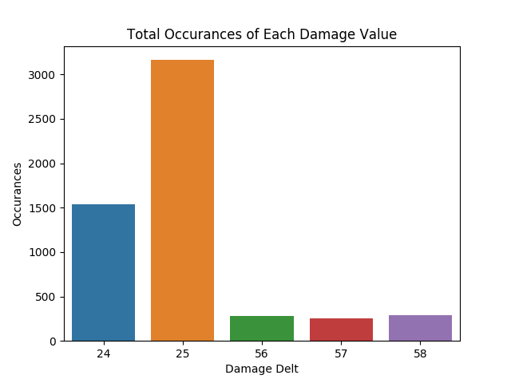
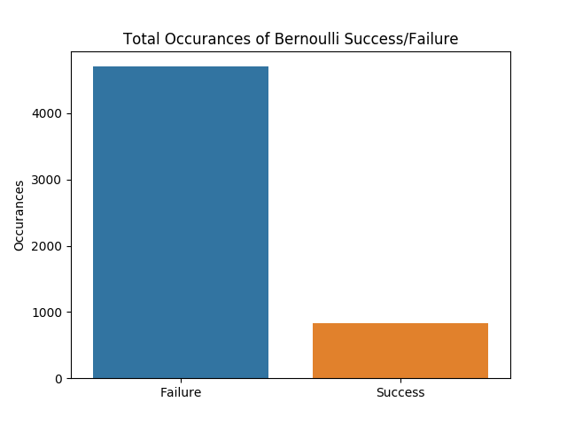
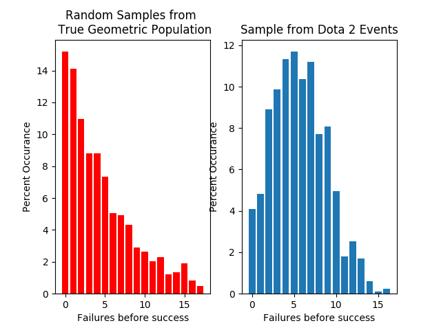
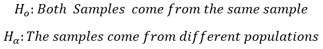

# Analysis of Random Event Generation in Computer Gaming 


## Introduction

  In modern computing, the generation of events with specific probabilities has been considered a necessary tool for applications ranging from executing computer simulation models, to running gambling machines. Another field where this is prevelant is in eSports, or competitive video gaming. With viewership [quickly growing and experts ancitipating it to become a billion dollar industry](http://www.businessinsider.com/esports-popularity-revenue-forecast-chart-2017-3), understanding the mechanism by which these games function can have major impacts. 
  
  <b>In this Readme, I will explore random event generation in the computer game Dota 2 by comparing the stated probabilities/expected results to collected gameplay data, to determine accuracy of the stated probability and if the events can be considered [independent and identically distributed random variables](https://en.wikipedia.org/wiki/Independent_and_identically_distributed_random_variables).</b>
  
  [General information about Dota 2 can be found here.](https://en.wikipedia.org/wiki/Dota_2)
  
  First we will walk through the application of a Monte Carlo experiment in order to generate data within the game, followed by the processing of this data. After, we will discuss the methods of the statistical tests utilized and end with our finalized results and conclusions.    

## Data Collection and Structure
  The first step of this experiment is to collect a large number of trials of one type of event in Dota 2, constituting a form of [Monte Carlo experiment](https://en.wikipedia.org/wiki/Monte_Carlo_method). Without diving too far into the details of the game, in our experiment we are observing the repeated attack by one player who has a stated 15% chance to deal bonus damage in order to compare the frequency of the attack bonus triggering (event sucess) to a true random event with sucess of 15%. While only one specific type of interaction is being tested, we can reasonably assume this random event generation mechanic extends beyond this specific instance.
  
  The events of the controlled in-game environment can be exported as a [log file](test.txt), automatically generating one entry for each event. Below is a sample:

```
{
	type: 0
	target: npc_dota_hero_axe
	target_source: npc_dota_hero_axe
	attacker_name: npc_dota_hero_phantom_assassin
	damage_source: npc_dota_hero_phantom_assassin
	is_attacker_illusion: 0
	is_attacker_hero: 1
	is_target_illusion: 0
	is_target_hero: 1
	is_visible_radiant: 1
	is_visible_dire: 1
	value: 24
	value: 7466
	timestamp: 2184.620
	last_hits: 0
}
```
  For the purposes of this analysis, we are concerned with "target" or "target_source", "attacker_name" or "damage_source", and the first "value" entry which represents the damage done. 
  
  We begin the script by importing our needed packages as well as our data.
```python
import matplotlib.pyplot as plt
import numpy as np
import pandas as pd
from scipy import stats
import math


with open('test.txt') as f:
	data = f.read()

data = [x.lstrip('\t}\n').split('\n\t') for x in data.split('\n}\n{\n')]
```
  Standard I/O functions from packages such as Pandas and Numpy do not work on this specific dataset's unique structure, so a line comprehension is used to break the data into a 2-dimensional array. In other words, we create a list of lists, with each list entry representing one event and each string entry representing an attribute of the event. The aforementioned event will be represented like so:
  
```
['type: 0', 'target: npc_dota_hero_axe', 'target_source: npc_dota_hero_axe', 'attacker_name: npc_dota_hero_phantom_assassin', 'damage_source: npc_dota_hero_phantom_assassin', 'is_attacker_illusion: 0', 'is_attacker_hero: 1', 'is_target_illusion: 0', 'is_target_hero: 1', 'is_visible_radiant: 1', 'is_visible_dire: 1', 'value: 24', 'value: 7466', 'timestamp: 2184.620', 'last_hits: 0']
```

  The dataset will also include entries not relevent to our analysis so a filter must be applied. Below is the iteration over the full dataset, where only entries of ```type: 0``` with our character in question as the "attacker_name" are included. If an entry meets this criteria, our value of interest (the damage dealt) will be added to the list ```dmg```.

```python
for x in data:
	try:
		if x[0] == 'type: 0' and x[3] == 'attacker_name: npc_dota_hero_phantom_assassin':
			dmg_val = x[11].split('value: ')[1]
			dmg_val = int(dmg_val)
			dmg.append(dmg_val)
	except IndexError:
		pass
```
<b>Note:</b> The usage of the error exception ```IndexError``` is needed since events of different types have different numbers of attributes and entries short enough will cause our script to fail. No data of interest is lost due to this exception since no events of ```type: 0``` will cause an ```IndexError```. 

After the ```dmg``` array is populated with the results from our Monte Carlo experiment, the data must be converted to Beroulli Sucess/Failure trials for further analysis. 

```python
dmg = np.array(dmg)
dmg_count = np.unique(dmg,return_counts=True)

x_axis1 = np.arange(5)
plt.figure(1)
plt.xlabel('Damage Delt')
plt.ylabel('Occurances')
plt.title('Total Occurances of Each Damage Value')
sns.barplot(x_axis1,dmg_count[1])
plt.xticks(x_axis1,dmg_count[0])
plt.show()
```



<b>Figure 1:</b> Occurance of damage values for all trials of the Monte Carlo experiment 

Based on the results seen in <b>Figure 1</b>, a clear distinction can be made between the higher damage success trials and the lower damage failure trials. The data now must be converted from the specific damage values to ```1``` (Success) or ```0``` (Failure). 

```python
bernoulli = []
for x in dmg:   #convert damage into bernouli trial 1=success, 0=failure
	if int(x) <=25:
		bernoulli.append(str(0))
	else:
		bernoulli.append(str(1))

bernoulli_count = np.unique(bernoulli,return_counts=True)
x_axis2 = np.arange(2)
plt.figure(2)
plt.ylabel('Occurances')
plt.title('Total Occurances of Bernoulli Success/Failure')
sns.barplot(x_axis2,bernoulli_count[1])
plt.xticks(x_axis2,('Failure','Success'))
plt.show()
```



<b>Figure 2:</b> Occurance of Bernoulli Success/Failure for converted damage observations

Part of our analysis involves utilizing the [Geometric Distribution](https://en.wikipedia.org/wiki/Geometric_distribution) so we must transform our array of Bernoulli trials to its geometric form, one observation being the number of trials between successes. In addition to this transformation, we must take a sample from a true geometric population. The stated probability of success from the game is 15%, so this will be used for the true geometric sample. For both we will be creating dictionaries, with the ```key``` being the number of trials between successes, and the entry being the number of observations. 

```python
bernoulli = ''.join(bernoulli)
bern_list = (bernoulli).split('1')


sample_data = {}

for x in bern_list:  #construct dictionary based on observed quantites for geometric
	if len(x) not in lengths:
		sample_data[len(x)] = 1
	else:
		sample_data[len(x)] += 1

tru_geo = np.random.geometric(.15,size=len(dist))
geo_dict = {}

for x in tru_geo.tolist():
	if x-1 not in geo_dict:
		geo_dict[x-1] = 1
	else:
		geo_dict[x-1] += 1
```

Something important to note is the usage of ```x-1``` when creating the dictionary for the true geometric sample. The reason for this is that the numpy function used to generate our sample makes observations of the number of trials needed to get a success, while we measured our sample data based on the number of failures before a success. Both are valid representations, but one must be adjusted to ensure our samples are equivalent in this regard.


## Statistical Analysis 
  
  Now that our data has been fully processed, we will begin our analysis. More rigorously, in this section we will examine the probability that our random variable for the sample is independantly and identically distributed with a 15% chance of success as stated by the game. First, we will examine the data graphically by comparing the [Empirical distribution function](https://en.wikipedia.org/wiki/Empirical_distribution_function) of our sample to our true geometric set. 
  
  ```python
  x_axis1 = [x for x in geo_dict if x < 18]
y_axis1 = [geo_dict[y]/len(dist)*100 for y in geo_dict if y < 18]

plt.figure(2)
plt.subplot(121)
plt.xlabel('Trials until success')
plt.ylabel('Percent Occurance')
plt.title('Random Samples from \n True Geometric Population')
plt.bar(x_axis1,y_axis1,color = 'red')


x_axis2 = [x for x in lengths]
y_axis2 = [lengths[y]/len(dist)*100 for y in lengths]

plt.subplot(122)
plt.xlabel('Trials until success')
plt.ylabel('Percent Occurance')
plt.title('Sample from Dota 2 Events')
plt.bar(x_axis2,y_axis2)
plt.show()
```
  
  
  From visual inspection we can see there are clear differences in the behaviors and outcomes of the two samples. The EDF for the geometric sample is what would be expected, with a roughly 15% chance of a success with zero failures, and decreasing probabilities thereafter. For our game sample we see that the probability of having zero failures is not near the expected 15% chance of occurance and actually has a maximum value centered around 5 failures. While this graphical representation provides us with some useful insight, a more mathematical approach must be taken to more rigorously prove the differences between the samples.
  
  ### Kolmogorov-Smirnov Test
  
  For the next part of our analysis we will employ the [Two Sample Kolmogorov-Smirnov Test (KS test)](https://en.wikipedia.org/wiki/Kolmogorov%E2%80%93Smirnov_test). This is a statistical test that measures the maximum difference between the EDF/CDF of two samples at a given point. We will define our formal hypothesis test as follows:
  
 
   
   <b>Note:</b>For our test statistic, E(i) refers to the value of the cumulative distribution function for our empirical samples. 
   
   
  
  
